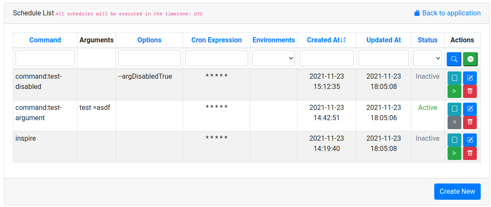
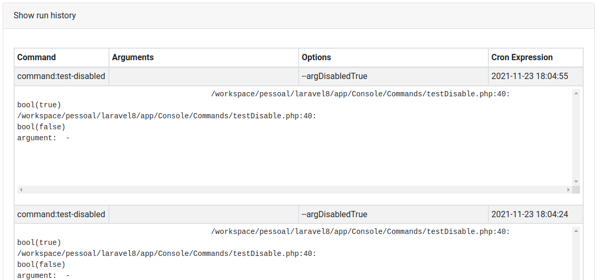

# Documentation

This librarian creates a route(default: /schedule) in your application where it is possible to manage which 
schedules will be executed at any given moment, these schedules are recorded in the database and can be changed, 
activated, inactivated or deleted via the interface without the need for a new application deployment.






## Installation

1. Run ```composer require robersonfaria/laravel-database-schedule```
2. Run ```php artisan migrate```

### Environment variables

You can set the following environment variables to configure schedules:

* SCHEDULE_TIMEZONE : The default is the same configured for the application, but if you need the schedules to run in a different timezone, it is possible to configure it with this variable
* SCHEDULE_CACHE_DRIVER : The default is `file`
* SCHEDULE_CACHE_ENABLE : The default is disabled when `APP_DEBUG=true` and enabled when `APP_DEBUG=false`

### Configurations

There are several library configuration options, to change the settings you can get the configuration file for your project
```
php artisan vendor:publish --provider="RobersonFaria\DatabaseSchedule\DatabaseSchedulingServiceProvider" --tag="config"
```

### Dashboard Authorization

Dashboard Authorization exposes a dashboard at `/schedule` URI.

In the configuration file it is possible to define whether to restrict access to route `/schedule`, the default is true. If access is restricted, the user must be logged in and meet the requirements defined in the `viewDatabaseSchedule` [gate controls access](https://laravel.com/docs/8.x/authorization#gates). 

```php
<?php
return [
    //...
    /**
     * If restricted_access is true, the user must be authenticated and meet the definition of `viewDatabaseSchedule` gate
     */
    'restricted_access' => env('SCHEDULE_RESTRICTED_ACCESS', true),
    //...
]
```
Note that this value can also be changed using the SCHEDULE_RESTRICTED_ACCESS environment variable.

*ATTENTION:* if restricted_access is set to false, access to the `/ schedule` route will be public.

You must define the gates in your service providers, laravel by default already brings the provider `App\Providers\AuthServiceProvider` for this purpose. See more in the Laravel documentation [https://laravel.com/docs/8.x/authorization#gates](https://laravel.com/docs/8.x/authorization#gates)

You are free to modify this gate as needed to restrict access to your Database Schedule Dashboard.

```php
protected function gate()
{
    Gate::define('viewDatabaseSchedule', function ($user) {
        return in_array($user->email, [
            'roberson.faria@gmail.com',
        ]);
    });
}
```

#### Examples:

If you want to limit access to a route to users who have a certain role, you can do so.
```php
Gate::define('viewDatabaseSchedule', function ($user) {
     return $user->hasRole('administrator');
});
```

Basically, if your gate has `return true` access will be allowed, if `return false` access will be restricted.


#### Groups:

If you have a lot of jobs, you can make managing them easier by enabling the groups feature in `config/database-schedule.php`:

```php
    /**
     * If you have a lot of jobs, you can group them for easier managing of jobs.
     */
    'enable_groups' => true,
```
This will allow you to filter in the job listing only the jobs belonging to a certain group.

### Scheduled Task Example

Create the command for your scheduled task `app/Console/Commands/test.php`:

```php
<?php

namespace App\Console\Commands;

use Illuminate\Console\Command;

class test extends Command
{
    /**
     * The name and signature of the console command.
     *
     * @var string
     */
    protected $signature = 'command:test {user} {initialDate} {finalDate}';

    /**
     * The console command description.
     *
     * @var string
     */
    protected $description = 'Command description';

    /**
     * Create a new command instance.
     *
     * @return void
     */
    public function __construct()
    {
        parent::__construct();
    }

    /**
     * Execute the console command.
     *
     * @return int
     */
    public function handle()
    {
        $this->info('Hello ' . $this->argument('user'));
        $this->info("Initial Date: " . $this->argument('initialDate'));
        $this->info("Final Date: " . $this->argument('finalDate'));
        return 0;
    }
}
```

Access the dashboard and the command will be listed for scheduling, create a schedule like the example below:


Run the artisan command to run scheduled tasks
```bash
php artisan schedule:run
```

The console output will look like this
```bash
Running scheduled command: ('/usr/bin/php7.4' 'artisan' command:test 1 '2022-02-02 00:00:00' '2022-04-02 00:00:00' > 'path/to/storage/logs/schedule-8763d2ce5a20ee888dd9d8a7e5a5cfcd4b315375.log' 2>&1 ;
```

If you marked the sending of the output by email you will receive an email similar to this one:


## Schedule List

You can also list registered and active commands using artisan command:

```bash
$ php artisan schedule:list

+----------------------------------------------------------------------------------------+-----------+-------------+----------------------------+
| Command                                                                                | Interval  | Description | Next Due                   |
+----------------------------------------------------------------------------------------+-----------+-------------+----------------------------+
| '/usr/bin/php7.4' 'artisan' inspire                                                    | * * * * * |             | 2022-03-02 17:05:00 +00:00 |
| '/usr/bin/php7.4' 'artisan' command:test 1 '2022-02-02 00:00:00' '2022-04-02 00:00:00' | * * * * * |             | 2022-03-02 17:05:00 +00:00 |
+----------------------------------------------------------------------------------------+-----------+-------------+----------------------------+
```


## CHANGELOG

[CHANGELOG.md](CHANGELOG.md)

## Credits

* That library was inspired by the library [therezor/laravel-database-schedule](https://github.com/therezor/laravel-database-schedule)
